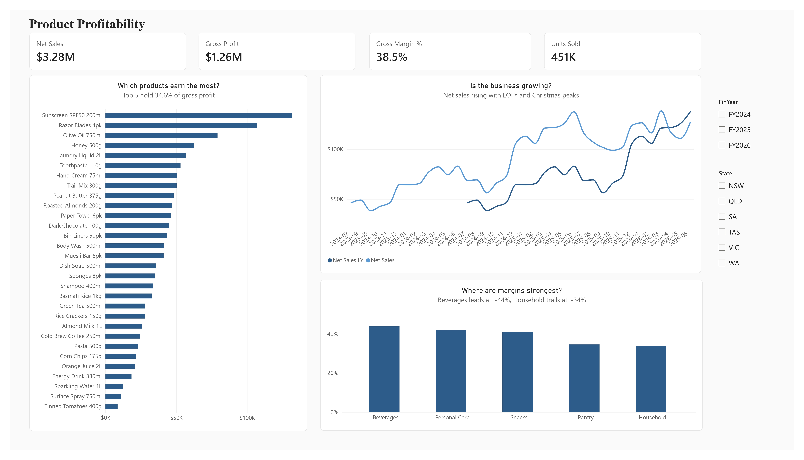
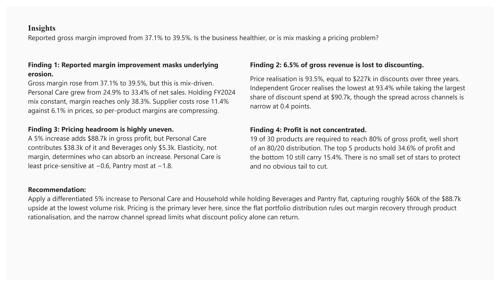
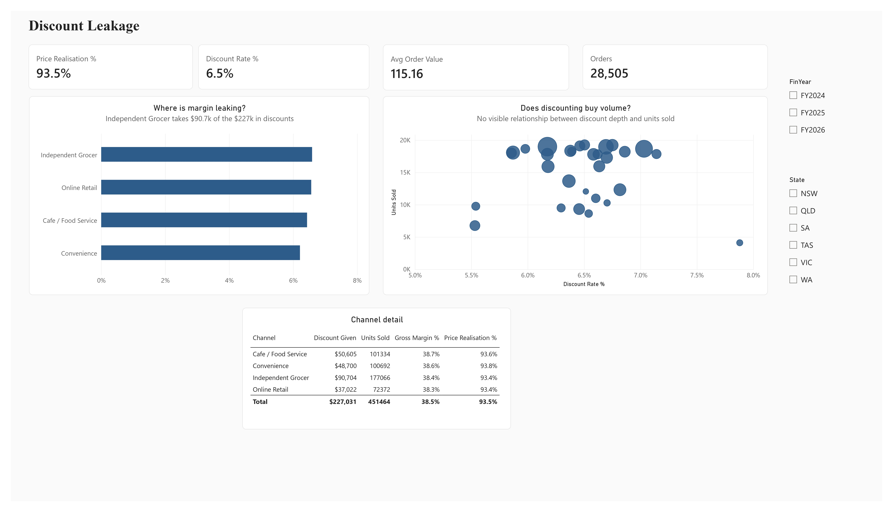
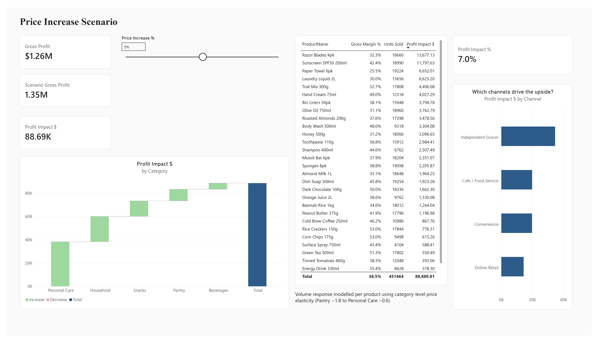
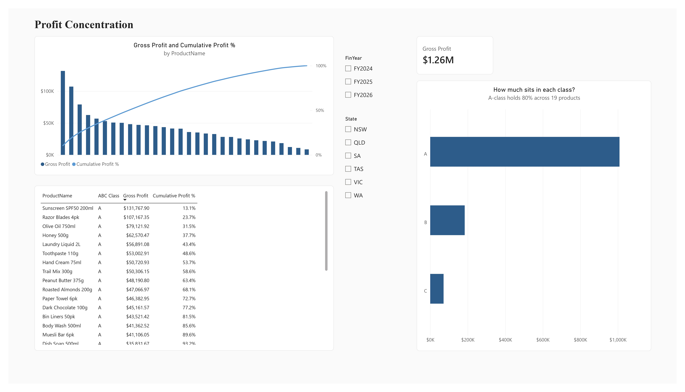
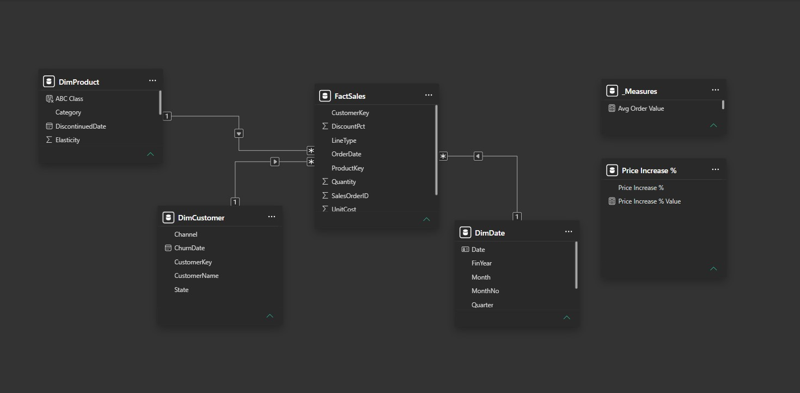
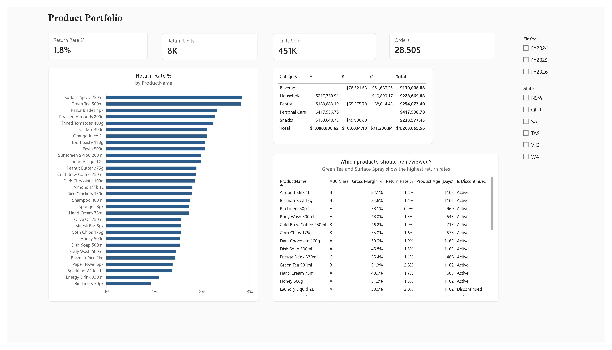

# Margin Analysis Dashboard — FMCG Wholesale

**Is reported margin improvement real, or is sales mix masking a pricing problem?**

Gross margin rose from 37.1% to 39.5% across FY2024–FY2026. This analysis tests
whether that reflects genuine improvement, and finds it does not.



## The finding

Reported margin improvement is **mix-driven, not performance-driven**.

| | FY2024 | FY2026 |
|---|---|---|
| Reported gross margin | 37.1% | 39.5% |
| Margin at FY2024 category mix | 37.1% | 38.3% |
| Average price vs 2023 base | ×1.000 | ×1.061 |
| Average unit cost vs 2023 base | ×1.026 | ×1.114 |

Supplier costs rose 11.4% while prices rose 6.1%, so per-product margins are
compressing across the portfolio. The headline improves because Personal Care
grew from 24.9% to 33.4% of net sales, pulling the blended figure upward.



## Supporting analysis

**Discount leakage: $227k over three years.** Price realisation is 93.5%.
Independent Grocer realises the lowest at 93.4% while taking the largest share
of discount spend at $90.7k, though the spread across channels is narrow at
0.4 points.



**Pricing headroom is uneven.** A 5% increase adds $88.7k in gross profit, but
Personal Care contributes $38.3k of that and Beverages only $5.3k. Elasticity,
not margin, determines who can absorb an increase.

| Price increase | Total profit impact |
|---|---|
| +2% | $37,599 |
| +5% | $88,690 |
| +10% | $159,684 |



**Profit is not concentrated.** 19 of 30 products are required to reach 80% of
gross profit, well short of an 80/20 distribution. The top 5 products hold
34.6% of profit and the bottom 10 still carry 15.4%. There is no small set of
stars to protect and no obvious tail to cut.



## Recommendation

Apply a differentiated 5% increase to Personal Care and Household while holding
Beverages and Pantry flat, capturing roughly $60k of the $88.7k upside at the
lowest volume risk. Pricing is the primary lever here, since the flat portfolio
distribution rules out margin recovery through product rationalisation, and the
narrow channel spread limits what discount policy alone can return.

## Data

IIM Skills dataset is used for this project: 28,900 order lines across 36
months (Jul 2023 to Jun 2026), 30 products in 5 categories, 180 trade accounts
across 6 Australian states.

## Data preparation (Power Query)

| Issue | Rows | Treatment |
|---|---|---|
| Exact duplicate lines | 60 | Removed first, before any other transform |
| Null `DiscountPct` | 867 | Replaced with 0, since blank meant no discount applied |
| Null `UnitCost` | 349 | Rows removed, as margin cannot be computed without cost |
| Inconsistent `State` casing and whitespace | — | Trim and uppercase; 16 distinct values reduced to 6 |

Return lines were retained rather than filtered. They carry negative quantities
and net off revenue correctly, giving net-of-returns figures throughout.

## Model

Star schema, one fact table at order-line grain with three dimensions:

```
DimDate ────────┐
DimProduct ─────┼──< FactSales
DimCustomer ────┘

Price Increase %   (disconnected parameter table)
```



All relationships are one-to-many with single cross-filter direction. `DimDate`
is a DAX calculated table carrying Australian financial-year logic and is
marked as a date table. Row-level security is configured on
`DimCustomer[State]`.

## Selected measures

Per-product price elasticity applied through the relationship:

```dax
Scenario Net Sales =
VAR Inc = SELECTEDVALUE( 'Price Increase %'[Price Increase %], 0 )
RETURN
SUMX(
    FactSales,
    VAR El = RELATED( DimProduct[Elasticity] )
    RETURN FactSales[Quantity] * ( 1 + Inc * El )
         * FactSales[UnitPrice] * ( 1 + Inc )
         * ( 1 - FactSales[DiscountPct] )
)
```

Pareto cumulative profit, using `ALLSELECTED` over the whole dimension so the
running total spans all products while still respecting outer slicers:

```dax
Cumulative Profit =
VAR CurrentRank = [Profit Rank]
RETURN
SUMX(
    FILTER( ALLSELECTED( DimProduct ), [Profit Rank] <= CurrentRank ),
    [Gross Profit]
)
```

## Two measurement errors worth noting

**Benchmark inflation.** `Price Realisation %` initially divided net sales by
quantity × `ListPrice`, returning 97% and looking healthy. But `ListPrice` is
the static 2023 base while transacted `UnitPrice` carries three years of
increases, so price inflation offset discounting and flattered the result.
Dividing by actual transacted value gives the true figure of 93.5%.

**Filter scope.** The Pareto measures first used
`ALLSELECTED( DimProduct[ProductName] )`, which clears the product filter but
leaves the ABC class grouping intact. The cumulative percentage restarted
within each class rather than running continuously. Widening to
`ALLSELECTED( DimProduct )` clears every column in the table and fixes it.

## Limitations

- Elasticity values are assumed, not estimated. With sufficient historical
  price variation they would be derived by regressing volume on price.
- Scenario outputs are point estimates with no confidence interval.
- Row-level security is a static demonstration; production would map users
  dynamically via `USERPRINCIPALNAME()`.
- Cross-price effects are not modelled. Raising the price of one product may
  shift volume to a substitute within the same category.

## Pages

1. Product Profitability
2. Profit Concentration
3. Price Increase Scenario
4. Discount Leakage
5. Product Portfolio
6. Insights



## Tools

Power BI Desktop · Power Query (M) · DAX
